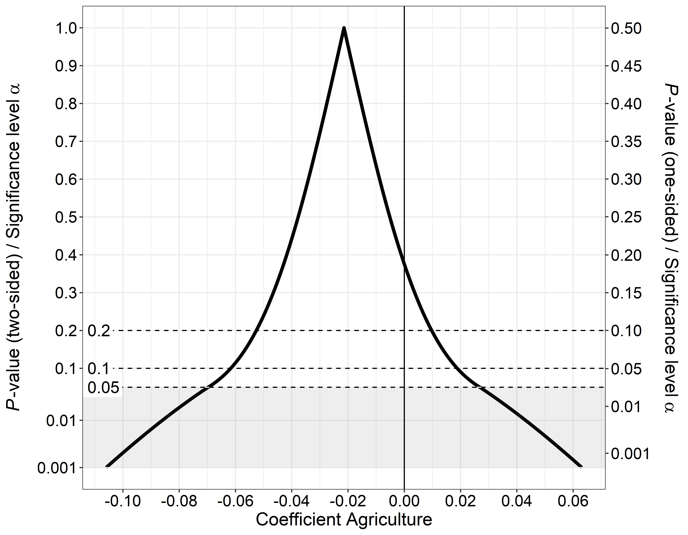
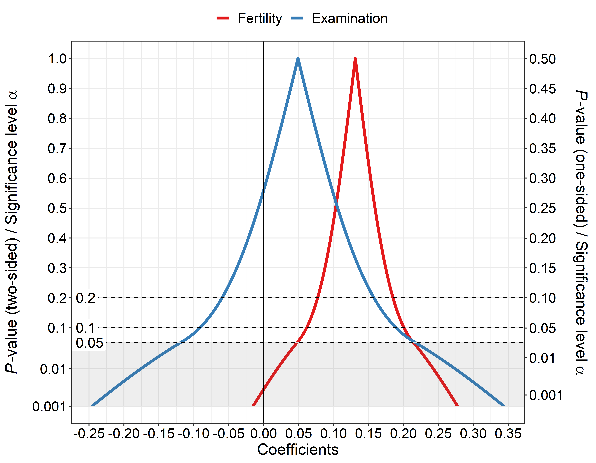
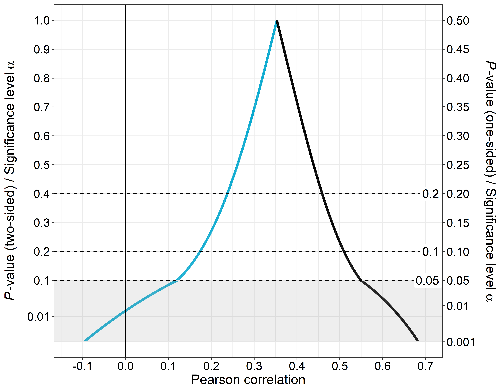
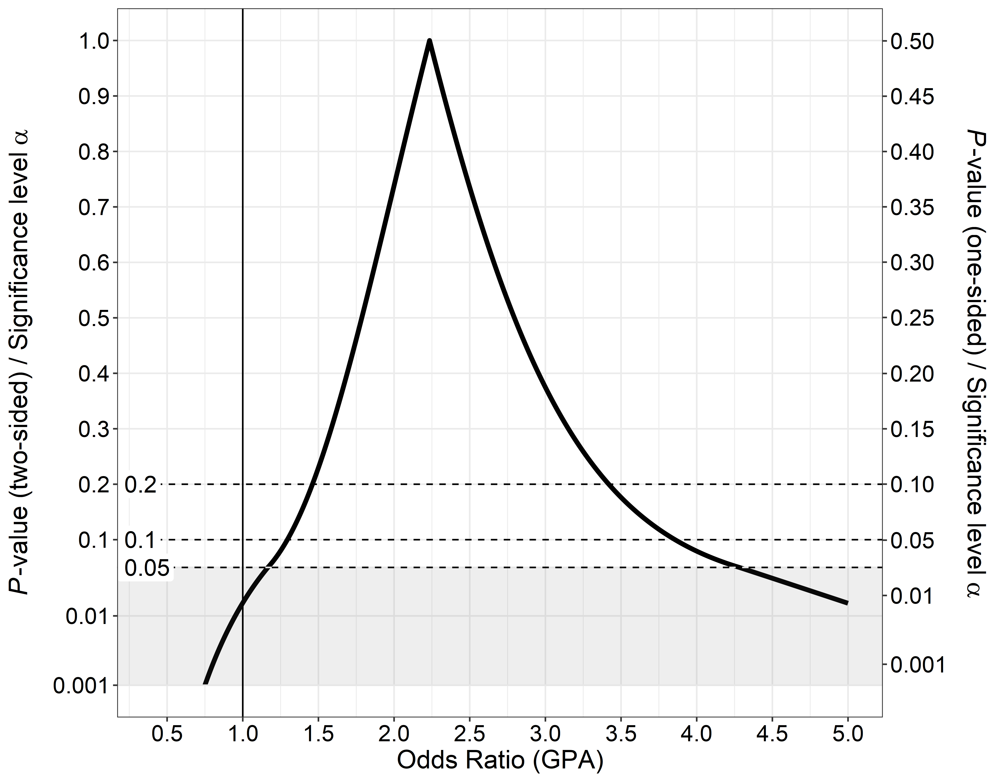

*P*-value functions
================

  - [Overview](#overview)
  - [Installation](#installation)
  - [Dependencies](#dependencies)
      - [Important information\!](#important-information)
  - [Usage](#usage)
      - [Required arguments for different estimate
        types](#required-arguments-for-different-estimate-types)
      - [Returned values](#returned-values)
  - [Examples](#examples)
      - [Two-sample *t*-test with unequal variances
        (Welch-Test)](#two-sample-t-test-with-unequal-variances-welch-test)
      - [Single coefficient from a linear regression
        model](#single-coefficient-from-a-linear-regression-model)
      - [Multiple coefficients from a linear regression
        model](#multiple-coefficients-from-a-linear-regression-model)
      - [Pearson correlation coefficient
        (one-sided)](#pearson-correlation-coefficient-one-sided)
      - [Odds ratio from logistic
        regression](#odds-ratio-from-logistic-regression)
      - [Proportion](#proportion)
      - [Difference between two independent
        proportions](#difference-between-two-independent-proportions)
      - [Difference between two independent proportions: Agresti-Caffo
        adjusted Wald
        interval](#difference-between-two-independent-proportions-agresti-caffo-adjusted-wald-interval)
  - [References](#references)
  - [Contact](#contact)
  - [Session info](#session-info)
  - [License](#license)

<!-- README.md is generated from README.Rmd. Please edit that file -->

## Overview

This repository contains R functions to create graphics of *p*-value
functions, confidence distributions, confidence densities, or the
[Surprisal value
(S-value)](http://www.umsl.edu/~fraundorfp/egsurpri.html) (Greenland
2019). An R-script to reproduce the plots in the publication is also
available.

## Installation

Upon release, you can download the package directly from CRAN by typing
`install.packages("pvaluefunctions")`.

Download the file `confidence_distributions.R` to your computer. You can
either `source()` the function in R or open it, select and run
everything. After loading the function, it’s ready for use.

To reproduce the plots from the publication, download the file
`paper_plots.R` and run it *after* loading the main function contained
in the file `confidence_distributions.R` (see above).

Alternatively, you can source the files directly from the GitHub
repository using the
[`devtools`](https://CRAN.R-project.org/package=devtools) package:

``` r
library(devtools)

# Load main function
source_url("https://raw.githubusercontent.com/DInfanger/pvaluefunctions/master/R/confidence_distributions.R")

# Load file to reproduce figures in the publication
source_url("https://raw.githubusercontent.com/DInfanger/pvalue_functions/master/R/paper_plots.R")
```

## Dependencies

The function depends on the following R packages, which need to be
installed beforehand:

  - ggplot2
  - scales
  - zipfR

Use the command `install.packages(c("ggplot2", "scales", "zipfR"))` in R
to install those packages.

### Important information\!

The newest version of [ggplot2
(3.1.1)](https://CRAN.R-project.org/package=ggplot2) has a
[bug](https://github.com/tidyverse/ggplot2/issues/2978) in `sec_axis`
that will lead to the secondary y-axis being labelled wrongly.

It is therefore recommended that you install the developmental version
of ggplot2 until the bug has been fixed. You can install the
developmental version using the following command (after installing the
[`devtools`](https://CRAN.R-project.org/package=devtools) package):
`devtools::install_github("tidyverse/ggplot2")`

## Usage

There is only one function needed to create the plots: `conf_dist()`.
The function has the following arguments:

  - `estimate`: Numerical vector containing the estimate(s).
  - `n`: Numerical vector containing the sample size(s). Required for
    correlations, variances, proportions and differences between
    proportions. Must be equal the number of estimates.
  - `df`: Numerical vector containing the degrees of freedom. Required
    for statistics based on the *t*-distribution (e.g. linear
    regression) and *t*-tests. Must be equal the number of estimates.
  - `stderr`: Numerical vector containing the standard error(s) of the
    estimate(s). Required for statistics based on the *t*-distribution
    (e.g. linear regression) and the normal distribution (e.g. logistic
    regression). Must be equal the number of estimate(s).
  - `tstat`: Numerical vector containing the *t*-statistic(s). Required
    for *t*-tests (means and mean differences). Must be equal the number
    of estimates.
  - `type`: String indicating the type of the estimate. Must be one of
    the following: `ttest`, `linreg`, `gammareg`, `general_t`, `logreg`,
    `poisreg`, `coxreg`, `general_z`, `pearson`, `spearman`, `kendall`,
    `var`, `prop`, `propdiff`.
  - `plot_type`: String indicating the type of plot. Must be one of the
    following: `cdf` (confidence distribution), `pdf` (confidence
    density), `p_val` (*p*-value function), `s_val` (Surprisal). For
    differences between independent proportions, only *p*-value
    functions and Surprisal value functions are available.
  - `n_values` (optional): Integer indicating the number of points that
    are used to generate the graphics. The higher this number, the
    higher the computation time and resolution.
  - `est_names` (optional): String vector indicating the names of the
    estimate(s). Must be equal the number of estimates.
  - `conf_level` (optional): Numerical vector indicating the confidence
    level(s). Bust be between 0 and 1.
  - `null_values` (optional): Numerical vector indicating the null
    value(s) in the plot
  - `trans` (optional): String indicating the transformation function
    that will be applied to the estimates and confidence curves. For
    example: “exp” for an exponential transformation of the log-odds in
    logistic regression.
  - `alternative`: String indicating if the confidence level(s) are
    two-sided or one-sided. Must be one of the following: `two_sided`,
    `one_sided`.
  - `log_yaxis`: Logical. Indicating if a portion of the y-axis should
    be displayed on the logarithmic scale.
  - `cut_logyaxis`: Numerical value indicating the threshold below which
    the y-axis will be displayed logarithmically. Must lie between 0 and
    1.
  - `xlab` (optional): String indicating the label of the x-axis.
  - `xlim` (optional): Optional numerical vector of length 2 indicating
    the limits of the x-axis on the *untransformed* scale.
  - `together`: Logical. Indicating if graphics for multiple estimates
    should be displayed together or on separate plots.
  - `plot_p_limit`: Numerical value indicating the lower limit of the
    y-axis. Must be greater than 0 for a logarithmic scale
    (i.e. `log_yaxis = TRUE`).

### Required arguments for different estimate types

  - *t*-tests: `estimate`, `df`, `tstat`.
  - Linear regression, Gamma regression, general estimates based on the
    *t*-distribution: `estimate`, `df`, `stderr`.
  - Logistic regression, Poisson regression, Cox regression, general
    estimates based on the normal distribution: `estimate`, `stderr`.
  - Correlation coefficients (Pearson, Spearman, Kendall), proportions,
    difference between proportions, variances: `estimate`, `n`.

### Returned values

The main function `conf_dist()` returns five objects in a list:

  - `res_frame`: A data frame containing the values used to construct
    the plot.
  - onf\_frame\`: A data frame containing the confidence intervals for
    the specified confidence levels for all estimates.
  - \*\*`counternull_frame`: A data frame containing the counternull
    values for the specified null values (see Rosenthal & Rubin (1994)
    for more information about the counternull).
  - `point_est`: A data frame containing the point estimates for all
    estimates. The point estimates correspond to the mean, median or
    mode of the confidence density (see Xie & Singh (2013) for more
    information). Estimates are produced using numerical procedures:
    Increase the number of points `n_values` for higher numerical
    precision.
  - `plot`: A [ggplot2](https://ggplot2.tidyverse.org/) plot object.

## Examples

### Two-sample *t*-test with unequal variances (Welch-Test)

``` r

#-----------------------------------------------------------------------------
# Installing package from GitHub and load package
#-----------------------------------------------------------------------------

devtools::install_github("DInfanger/pvaluefunctions")

library(pvaluefunctions)

#-----------------------------------------------------------------------------
# T-Test
#-----------------------------------------------------------------------------

with(sleep, mean(extra[group == 1])) - with(sleep, mean(extra[group == 2]))
#> [1] -1.58
t.test(extra ~ group, data = sleep, var.equal = FALSE)
#> 
#>  Welch Two Sample t-test
#> 
#> data:  extra by group
#> t = -1.8608, df = 17.776, p-value = 0.07939
#> alternative hypothesis: true difference in means is not equal to 0
#> 95 percent confidence interval:
#>  -3.3654832  0.2054832
#> sample estimates:
#> mean in group 1 mean in group 2 
#>            0.75            2.33

#-----------------------------------------------------------------------------
# Create p-value function
#-----------------------------------------------------------------------------

res <- conf_dist(
  estimate = c(-1.58)
  , df = c(17.77647)
  , tstat = c(-1.860813)
  , type = "ttest"
  , plot_type = "p_val"
  , n_values = 1e4L
  # , est_names = c("")
  , conf_level = c(0.95, 0.90, 0.80)
  , null_values = c(0)
  , trans = "identity"
  , alternative = "two_sided"
  , log_yaxis = TRUE
  , cut_logyaxis = 0.05
  , xlab = "Mean difference (group 1 - group 2)"
  , together = FALSE
  , plot_p_limit = 1 - 0.999
)
```


### Single coefficient from a linear regression model

#### *P*-value function

``` r
#-----------------------------------------------------------------------------
# Model
#-----------------------------------------------------------------------------

mod <- lm(Infant.Mortality~Agriculture + Fertility + Examination, data = swiss)

summary(mod)
#> 
#> Call:
#> lm(formula = Infant.Mortality ~ Agriculture + Fertility + Examination, 
#>     data = swiss)
#> 
#> Residuals:
#>     Min      1Q  Median      3Q     Max 
#> -8.5375 -1.4021 -0.0066  1.7381  5.9150 
#> 
#> Coefficients:
#>             Estimate Std. Error t value Pr(>|t|)   
#> (Intercept) 11.01896    4.47291   2.463  0.01784 * 
#> Agriculture -0.02143    0.02394  -0.895  0.37569   
#> Fertility    0.13115    0.04145   3.164  0.00285 **
#> Examination  0.04913    0.08351   0.588  0.55942   
#> ---
#> Signif. codes:  0 '***' 0.001 '**' 0.01 '*' 0.05 '.' 0.1 ' ' 1
#> 
#> Residual standard error: 2.645 on 43 degrees of freedom
#> Multiple R-squared:  0.2291, Adjusted R-squared:  0.1753 
#> F-statistic:  4.26 on 3 and 43 DF,  p-value: 0.01014

#-----------------------------------------------------------------------------
# Create p-value function
#-----------------------------------------------------------------------------

res <- conf_dist(
  estimate = c(-0.02143)
  , df = c(43)
  , stderr = (0.02394)
  , type = "linreg"
  , plot_type = "p_val"
  , n_values = 1e4L
  # , est_names = c("")
  , conf_level = c(0.95, 0.90, 0.80)
  , null_values = c(0)
  , trans = "identity"
  , alternative = "two_sided"
  , log_yaxis = TRUE
  , cut_logyaxis = 0.05
  , xlab = "Coefficient Agriculture"
  , together = FALSE
  , plot_p_limit = 1 - 0.999
)
```



#### Confidence distribution

``` r
res <- conf_dist(
  estimate = c(-0.02143)
  , df = c(43)
  , stderr = (0.02394)
  , type = "linreg"
  , plot_type = "cdf"
  , n_values = 1e4L
  # , est_names = c("")
  , conf_level = c(0.95, 0.90, 0.80)
  , null_values = c(0)
  , trans = "identity"
  , alternative = "two_sided"
  # , log_yaxis = TRUE
  # , cut_logyaxis = 0.05
  , xlab = "Coefficient Agriculture"
  , xlim = c(-0.12, 0.065)
  , together = FALSE
  # , plot_p_limit = 1 - 0.999
)
```


### Multiple coefficients from a linear regression model

#### *P*-value functions

``` r
res <- conf_dist(
  estimate = c(0.13115, 0.04913)
  , df = c(43, 43)
  , stderr = c(0.04145, 0.08351)
  , type = "linreg"
  , plot_type = "p_val"
  , n_values = 1e4L
  , est_names = c("Fertility", "Examination")
  , conf_level = c(0.95, 0.90, 0.80)
  , null_values = c(0)
  , trans = "identity"
  , alternative = "two_sided"
  , log_yaxis = TRUE
  , cut_logyaxis = 0.05
  , xlab = "Coefficients"
  , together = TRUE
  , plot_p_limit = 1 - 0.999
)
```



#### Surprisal values

``` r
res <- conf_dist(
  estimate = c(0.13115, 0.04913)
  , df = c(43, 43)
  , stderr = c(0.04145, 0.08351)
  , type = "linreg"
  , plot_type = "s_val"
  , n_values = 1e4L
  , est_names = c("Fertility", "Examination")
  , conf_level = c(0.95, 0.90, 0.80)
  , null_values = c(0)
  , trans = "identity"
  , alternative = "two_sided"
  # , log_yaxis = TRUE
  # , cut_logyaxis = 0.05
  , xlab = "Coefficients"
  , together = TRUE
  , plot_p_limit = 1 - 0.999
)
```


### Pearson correlation coefficient (one-sided)

``` r
#-----------------------------------------------------------------------------
# Calculate Pearson's correlation coefficient
#-----------------------------------------------------------------------------

cor.test(swiss$Fertility, swiss$Agriculture, alternative = "two.sided", method = "pearson")
#> 
#>  Pearson's product-moment correlation
#> 
#> data:  swiss$Fertility and swiss$Agriculture
#> t = 2.5316, df = 45, p-value = 0.01492
#> alternative hypothesis: true correlation is not equal to 0
#> 95 percent confidence interval:
#>  0.07334947 0.58130587
#> sample estimates:
#>       cor 
#> 0.3530792

#-----------------------------------------------------------------------------
# Create p-value function
#-----------------------------------------------------------------------------

res <- conf_dist(
  estimate = c(0.3530792)
  , n = 47
  , type = "pearson"
  , plot_type = "p_val"
  , n_values = 1e4L
  # , est_names = c("")
  , conf_level = c(0.95, 0.90, 0.80)
  , null_values = c(0)
  , trans = "identity"
  , alternative = "one_sided"
  , log_yaxis = TRUE
  , cut_logyaxis = 0.05
  , xlab = "Pearson correlation"
  , together = TRUE
  , plot_p_limit = 1 - 0.999
)
```



### Odds ratio from logistic regression

``` r
#-----------------------------------------------------------------------------
# Calculate logistic regression model using a dataset from UCLA
#-----------------------------------------------------------------------------

dat_tmp <- read.csv("https://stats.idre.ucla.edu/stat/data/binary.csv")

dat_tmp$rank <- factor(dat_tmp$rank)
logistic_mod <- glm(admit ~ gre + gpa + rank, data = dat_tmp, family = "binomial")

summary(logistic_mod)
#> 
#> Call:
#> glm(formula = admit ~ gre + gpa + rank, family = "binomial", 
#>     data = dat_tmp)
#> 
#> Deviance Residuals: 
#>     Min       1Q   Median       3Q      Max  
#> -1.6268  -0.8662  -0.6388   1.1490   2.0790  
#> 
#> Coefficients:
#>              Estimate Std. Error z value Pr(>|z|)    
#> (Intercept) -3.989979   1.139951  -3.500 0.000465 ***
#> gre          0.002264   0.001094   2.070 0.038465 *  
#> gpa          0.804038   0.331819   2.423 0.015388 *  
#> rank2       -0.675443   0.316490  -2.134 0.032829 *  
#> rank3       -1.340204   0.345306  -3.881 0.000104 ***
#> rank4       -1.551464   0.417832  -3.713 0.000205 ***
#> ---
#> Signif. codes:  0 '***' 0.001 '**' 0.01 '*' 0.05 '.' 0.1 ' ' 1
#> 
#> (Dispersion parameter for binomial family taken to be 1)
#> 
#>     Null deviance: 499.98  on 399  degrees of freedom
#> Residual deviance: 458.52  on 394  degrees of freedom
#> AIC: 470.52
#> 
#> Number of Fisher Scoring iterations: 4

rm(dat_tmp)

#-----------------------------------------------------------------------------
# Create p-value function
#-----------------------------------------------------------------------------

res <- conf_dist(
  estimate = c(0.804037549)
  , stderr = c(0.331819298)
  , type = "logreg"
  , plot_type = "p_val"
  , n_values = 1e4L
  , est_names = c("GPA")
  , conf_level = c(0.95, 0.90, 0.80)
  , null_values = c(log(1))
  , trans = "exp"
  , alternative = "two_sided"
  , log_yaxis = TRUE
  , cut_logyaxis = 0.05
  , xlab = "Odds Ratio (GPA)"
  , xlim = log(c(0.4, 5))
  , together = FALSE
  , plot_p_limit = 1 - 0.999
)
```



### Proportion

``` r
res <- conf_dist(
  estimate = c(0.44)
  , n = c(50)
  , type = "prop"
  , plot_type = "p_val"
  , n_values = 1e4L
  # , est_names = c("")
  , conf_level = c(0.95, 0.90, 0.80)
  , null_values = c(0.5)
  , trans = "identity"
  , alternative = "two_sided"
  , log_yaxis = TRUE
  , cut_logyaxis = 0.05
  , xlab = "Proportion"
  # , xlim = log(c(0.95, 1.2))
  , together = FALSE
  , plot_p_limit = 1 - 0.999
)
```


### Difference between two independent proportions

``` r
res <- conf_dist(
  estimate = c(68/100, 98/150)
  , n = c(100, 150)
  , type = "propdiff"
  , plot_type = "p_val"
  , n_values = 1e4L
  , conf_level = c(0.95, 0.90, 0.80)
  , null_values = c(0)
  , trans = "identity"
  , alternative = "two_sided"
  , log_yaxis = TRUE
  , cut_logyaxis = 0.05
  , xlab = "Difference between proportions"
  , together = FALSE
  , plot_p_limit = 1 - 0.9999
)
```


### Difference between two independent proportions: Agresti-Caffo adjusted Wald interval

The standard Wald interval can be modified in a simple manner to
drastically improve its coverage probabilities. Simply add 1 to the
number of successes and add 2 to the sample size for both proportions.
Then proceed to calculate the Wald interval with these modified data.
The point estimate for the difference between proportions is still
calculated using the unmodified data. The function `conf_dist` does not
have a dedicaded type for this kind of estimator but as the Wald
interval is based on the normal distribution, we can use `type =
general_z` to create the *p*-value function.

``` r

# First proportion

x1 <- 8
n1 <- 40

# Second proportion

x2 <- 11
n2 <- 30

# Apply the correction 

p1hat <- (x1 + 1)/(n1 + 2)
p2hat <- (x2 + 1)/(n2 + 2)

# The estimator (unmodified)

est0 <- (x1/n1) - (x2/n2)

# The modified estimator and its standard error using the correction

est <- p1hat - p2hat
se <- sqrt(((p1hat*(1 - p1hat))/(n1 + 2)) + ((p2hat*(1 - p2hat))/(n2 + 2)))

res <- conf_dist(
  estimate = c(est)
  , stderr = c(se)
  , type = "general_z"
  , plot_type = "p_val"
  , n_values = 1e4L
  # , est_names = c("Estimate")
  , log_yaxis = TRUE
  , cut_logyaxis = 0.05
  , conf_level = c(0.95, 0.99)
  , null_values = c(0, 0.3)
  , trans = "identity"
  , alternative = "two_sided"
  , xlab = "Difference between proportions"
  # , xlim = c(-0.75, 0.5)
  , together = FALSE
  , plot_p_limit = 1 - 0.9999
)
```


## References

Bender R, Berg G, Zeeb H. (2005): Tutorial: using confidence curves in
medical research. *Biom J.* 47(2): 237-47.

Fraser D. A. S. (2019): The *p*-value function and statistical
inference. *The American Statistician,* 73:sup1, 135-147.

Greenland S (2019): Valid *P*-Values Behave Exactly as They Should: Some
Misleading Criticisms of *P*-Values and Their Resolution with
*S*-Values. *The American Statistician,* 73sup1, 106-114.

Poole C. (1987a): Beyond the confidence interval. *Am J Public Health.*
77(2): 195-9.

Poole C. (1987b) Confidence intervals exclude nothing. *Am J Public
Health.* 77(4): 492-3.

Rosenthal R, Rubin DB. (1994): The counternull value of an effect size:
A new statistic. Psychol Sci. 5(6): 329-34.

Schweder T, Hjort NL. (2016): Confidence, likelihood, probability:
statistical inference with confidence distributions. New York, NY:
Cambridge University Press.

Xie M, Singh K, Strawderman WE. (2011): Confidence Distributions and a
Unifying Framework for Meta-Analysis. *J Am Stat Assoc* 106(493):
320-33. doi: 10.1198/jasa.2011.tm09803.

Xie Mg, Singh K. (2013): Confidence distribution, the frequentist
distribution estimator of a parameter: A review. *Internat Statist Rev.*
81(1): 3-39.

## Contact

[Denis Infanger](https://dsbg.unibas.ch/de/personen/denis-infanger/)

## Session info

    #> R version 3.6.0 (2019-04-26)
    #> Platform: x86_64-w64-mingw32/x64 (64-bit)
    #> Running under: Windows 10 x64 (build 17134)
    #> 
    #> Matrix products: default
    #> 
    #> locale:
    #> [1] LC_COLLATE=German_Switzerland.1252  LC_CTYPE=German_Switzerland.1252   
    #> [3] LC_MONETARY=German_Switzerland.1252 LC_NUMERIC=C                       
    #> [5] LC_TIME=German_Switzerland.1252    
    #> 
    #> attached base packages:
    #> [1] stats     graphics  grDevices utils     datasets  methods   base     
    #> 
    #> other attached packages:
    #> [1] pvaluefunctions_1.1.0
    #> 
    #> loaded via a namespace (and not attached):
    #>  [1] Rcpp_1.0.1         RColorBrewer_1.1-2 pillar_1.4.0      
    #>  [4] compiler_3.6.0     prettyunits_1.0.2  remotes_2.0.4     
    #>  [7] tools_3.6.0        testthat_2.1.1     digest_0.6.19     
    #> [10] pkgbuild_1.0.3     pkgload_1.0.2      tibble_2.1.1      
    #> [13] gtable_0.3.0       evaluate_0.13      memoise_1.1.0     
    #> [16] pkgconfig_2.0.2    rlang_0.3.4        cli_1.1.0         
    #> [19] curl_3.3           yaml_2.2.0         xfun_0.7          
    #> [22] dplyr_0.8.1        withr_2.1.2        stringr_1.4.0     
    #> [25] knitr_1.23         desc_1.2.0         fs_1.3.1          
    #> [28] devtools_2.0.2     tidyselect_0.2.5   rprojroot_1.3-2   
    #> [31] grid_3.6.0         glue_1.3.1         R6_2.4.0          
    #> [34] processx_3.3.1     rmarkdown_1.13     sessioninfo_1.1.1 
    #> [37] purrr_0.3.2        callr_3.2.0        ggplot2_3.1.1.9000
    #> [40] magrittr_1.5       scales_1.0.0       backports_1.1.4   
    #> [43] ps_1.3.0           htmltools_0.3.6    usethis_1.5.0     
    #> [46] assertthat_0.2.1   colorspace_1.4-1   labeling_0.3      
    #> [49] stringi_1.4.3      lazyeval_0.2.2     munsell_0.5.0     
    #> [52] crayon_1.3.4

## License

[](https://www.gnu.org/licenses/gpl-3.0)

[GNU General Public License v3.0](https://www.gnu.org/licenses/gpl-3.0).
