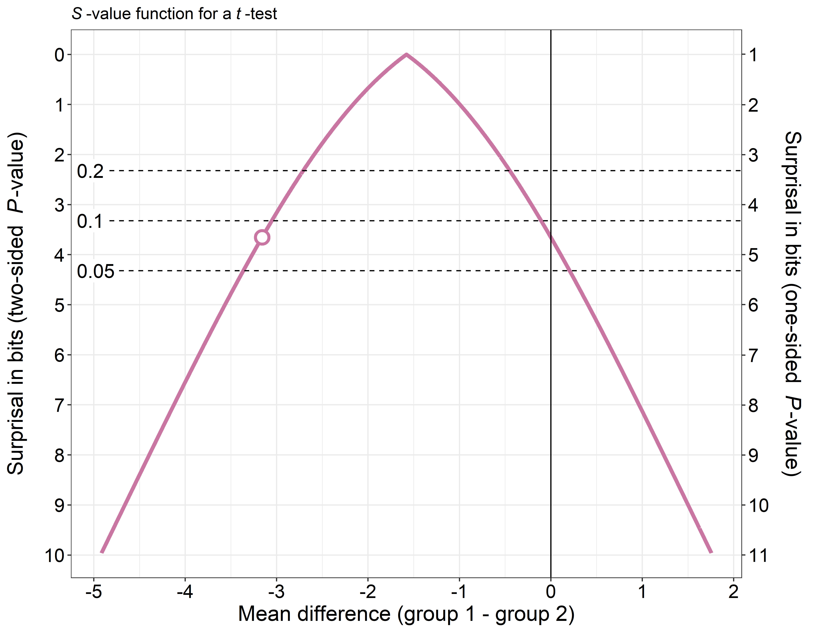

pvaluefunctions
================

  - [*P*-value functions
    ](#p-value-functions)
      - [Accompanying paper](#accompanying-paper)
          - [Recreation of the figures in the
            paper](#recreation-of-the-figures-in-the-paper)
      - [Overview](#overview)
      - [Installation](#installation)
      - [Dependencies](#dependencies)
      - [Examples](#examples)
      - [References](#references)
      - [Contact](#contact)
      - [Session info](#session-info)
      - [License](#license)

<!-- README.md is generated from README.Rmd. Please edit that file -->

# *P*-value functions 

## Accompanying paper

We published an [accompanying paper](https://doi.org/10.1002/sim.8293)
to illustrate the use of *p*-value functions:

Infanger D, Schmidt-Trucksäss A. (2019): *P* value functions: An
underused method to present research results and to promote quantitative
reasoning. *Statistics in Medicine.* **38**: 4189-4197. doi:
10.1002/sim.8293.

### Recreation of the figures in the paper

The code and instructions to reproduce all graphics in our paper can be
found in the following GitHub repository:
<https://github.com/DInfanger/pvalue_functions>

## Overview

This is the repository for the R-package
[`pvaluefunctions`](https://cran.r-project.org/package=pvaluefunctions).
The package contains R functions to create graphics of *p*-value
functions, confidence distributions, confidence densities, or the
[Surprisal value
(S-value)](http://www.umsl.edu/~fraundorfp/egsurpri.html) (Greenland
2019).

## Installation

You can install the package directly from CRAN by typing
`install.packages("pvaluefunctions")`. After installation, load it in R
using `library(pvaluefunctions)`.

## Dependencies

The function depends on the following R packages, which need to be
installed beforehand:

  - ggplot2 (at least version 3.2.1)
  - scales
  - zipfR

Use the command `install.packages(c("ggplot2", "scales", "zipfR"))` in R
to install those packages.

<!-- ### Important information! -->

<!-- The newest version of [ggplot2 (3.1.1)](https://CRAN.R-project.org/package=ggplot2) has a [bug](https://github.com/tidyverse/ggplot2/issues/2978) in `sec_axis` that will lead to the secondary y-axis being labelled wrongly. -->

<!-- It is therefore recommended that you install the developmental version of ggplot2 until the bug has been fixed. You can install the developmental version using the following command (after installing the [`devtools`](https://CRAN.R-project.org/package=devtools) package): `devtools::install_github("tidyverse/ggplot2")` -->

<!-- To see what version of ggplot2 has been used to create the plots on this page, see the [Session info]. -->

<!-- This warning will be deleted upon the release of a new version of ggplot2 that fixes the bug. -->

## Examples

For more examples and code, see the
[vignette](https://CRAN.R-project.org/package=pvaluefunctions/vignettes/pvaluefun.html).

    #> 
    #>          checking for file 'C:\Users\denis\AppData\Local\Temp\RtmpQjnMlH\remotes2cec1c06887\DInfanger-pvaluefunctions-8126196/DESCRIPTION' ...  v  checking for file 'C:\Users\denis\AppData\Local\Temp\RtmpQjnMlH\remotes2cec1c06887\DInfanger-pvaluefunctions-8126196/DESCRIPTION'
    #>       -  preparing 'pvaluefunctions':
    #>    checking DESCRIPTION meta-information ...     checking DESCRIPTION meta-information ...   v  checking DESCRIPTION meta-information
    #>       -  checking for LF line-endings in source and make files and shell scripts
    #>   -  checking for empty or unneeded directories
    #>       -  building 'pvaluefunctions_1.6.0.tar.gz'
    #>      
    #> 

## References

Bender R, Berg G, Zeeb H. (2005): Tutorial: using confidence curves in
medical research. *Biom J.* 47(2): 237-47.

Fraser D. A. S. (2019): The *p*-value function and statistical
inference. *Am Stat,* 73:sup1, 135-147.

Greenland S (2019): Valid *P*-Values Behave Exactly as They Should: Some
Misleading Criticisms of *P*-Values and Their Resolution with
*S*-Values. *Am Stat,* 73sup1, 106-114.

Infanger D, Schmidt-Trucksäss A. (2019): *P* value functions: An
underused method to present research results and to promote quantitative
reasoning. *Stat Med,* 38, 4189-4197. doi: 10.1002/sim.8293.

Poole C. (1987a): Beyond the confidence interval. *Am J Public Health.*
77(2): 195-9.

Poole C. (1987b) Confidence intervals exclude nothing. *Am J Public
Health.* 77(4): 492-3.

Rosenthal R, Rubin DB. (1994): The counternull value of an effect size:
A new statistic. Psychol Sci. 5(6): 329-34.

Schweder T, Hjort NL. (2016): Confidence, likelihood, probability:
statistical inference with confidence distributions. New York, NY:
Cambridge University Press.

Xie M, Singh K, Strawderman WE. (2011): Confidence Distributions and a
Unifying Framework for Meta-Analysis. *J Am Stat Assoc* 106(493):
320-33. doi: 10.1198/jasa.2011.tm09803.

Xie Mg, Singh K. (2013): Confidence distribution, the frequentist
distribution estimator of a parameter: A review. *Internat Statist Rev.*
81(1): 3-39.

## Contact

[Denis Infanger](https://dsbg.unibas.ch/de/personen/denis-infanger/)

## Session info

    #> R version 4.0.0 (2020-04-24)
    #> Platform: x86_64-w64-mingw32/x64 (64-bit)
    #> Running under: Windows 10 x64 (build 18363)
    #> 
    #> Matrix products: default
    #> 
    #> locale:
    #> [1] LC_COLLATE=German_Switzerland.1252  LC_CTYPE=German_Switzerland.1252   
    #> [3] LC_MONETARY=German_Switzerland.1252 LC_NUMERIC=C                       
    #> [5] LC_TIME=German_Switzerland.1252    
    #> 
    #> attached base packages:
    #> [1] stats     graphics  grDevices utils     datasets  methods   base     
    #> 
    #> other attached packages:
    #> [1] pvaluefunctions_1.6.0
    #> 
    #> loaded via a namespace (and not attached):
    #>  [1] Rcpp_1.0.4.6      pillar_1.4.3      compiler_4.0.0    prettyunits_1.1.1
    #>  [5] remotes_2.1.1     tools_4.0.0       testthat_2.3.2    digest_0.6.25    
    #>  [9] pkgbuild_1.0.7    pkgload_1.0.2     tibble_3.0.1      lifecycle_0.2.0  
    #> [13] gtable_0.3.0      evaluate_0.14     memoise_1.1.0     pkgconfig_2.0.3  
    #> [17] rlang_0.4.5       cli_2.0.2         curl_4.3          yaml_2.2.1       
    #> [21] xfun_0.13         dplyr_0.8.5       withr_2.2.0       stringr_1.4.0    
    #> [25] knitr_1.28        vctrs_0.2.4       desc_1.2.0        fs_1.4.1         
    #> [29] devtools_2.3.0    tidyselect_1.0.0  grid_4.0.0        rprojroot_1.3-2  
    #> [33] glue_1.4.0        R6_2.4.1          processx_3.4.2    fansi_0.4.1      
    #> [37] rmarkdown_2.1     sessioninfo_1.1.1 farver_2.0.3      purrr_0.3.4      
    #> [41] ggplot2_3.3.0     callr_3.4.3       magrittr_1.5      scales_1.1.0     
    #> [45] backports_1.1.6   ps_1.3.2          ellipsis_0.3.0    htmltools_0.4.0  
    #> [49] usethis_1.6.1     assertthat_0.2.1  colorspace_1.4-1  stringi_1.4.6    
    #> [53] munsell_0.5.0     crayon_1.3.4

## License

